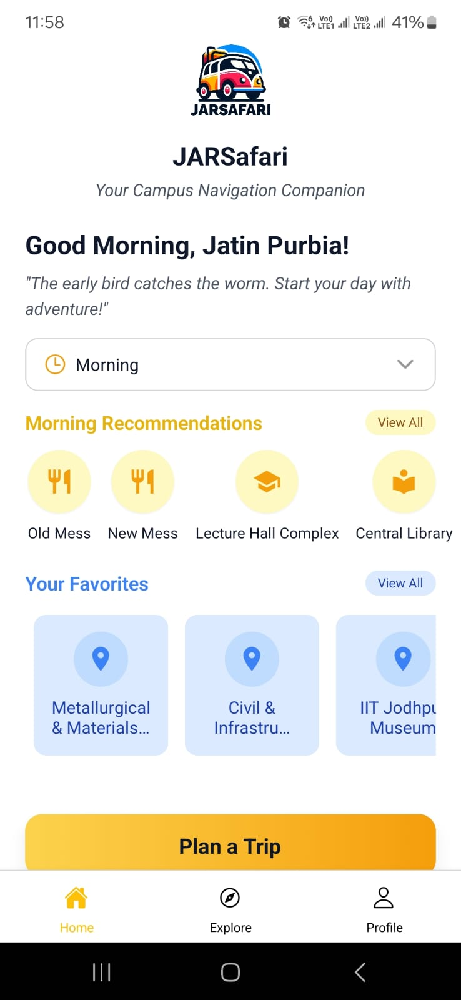
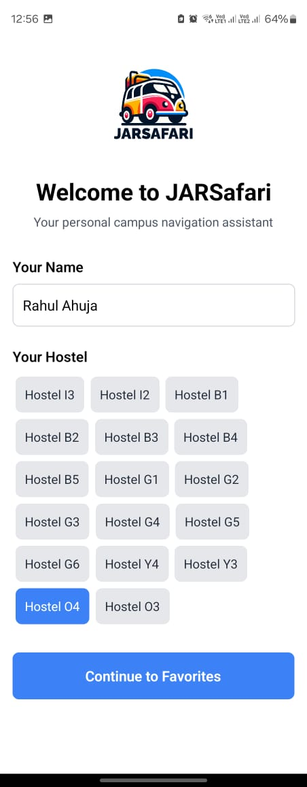
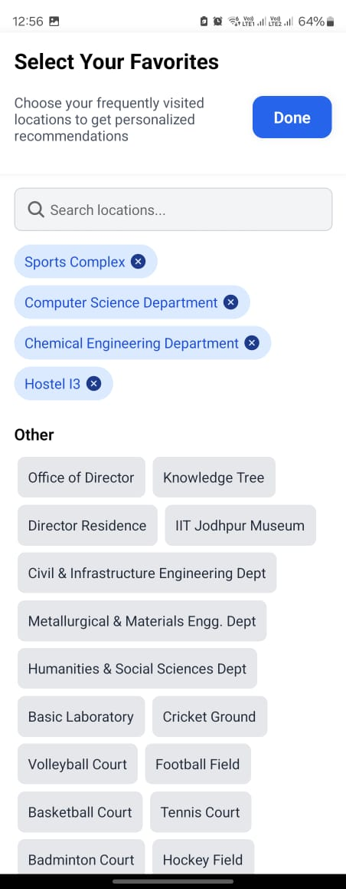
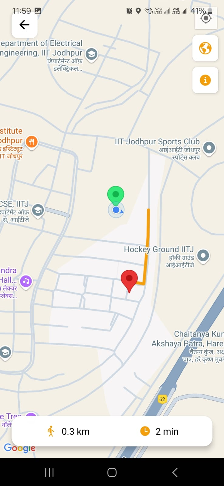
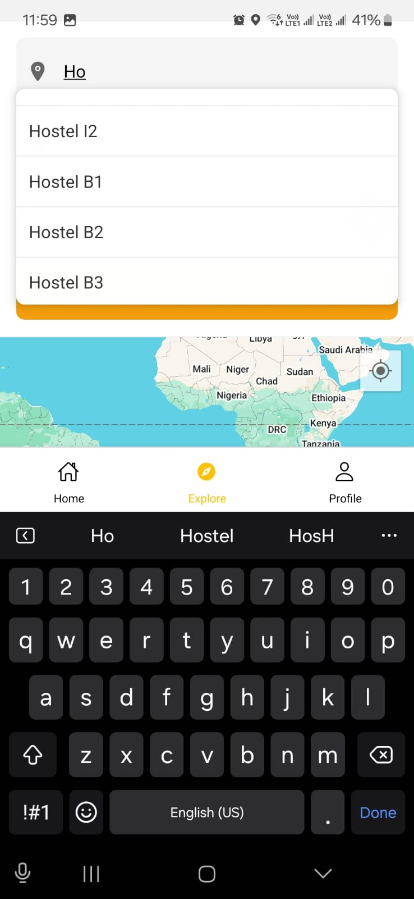
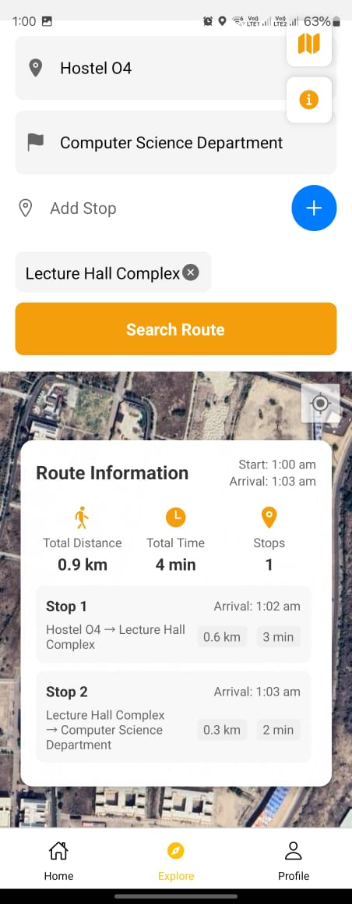

# JARSafari 🚶‍♂️📍

**JARSafari** is a personalized campus navigation app designed specifically for **IIT Jodhpur**. It provides optimized, real-time routes between campus locations like hostels, mess, academic blocks, and more. Unlike general-purpose maps, JARSafari supports **multi-stop navigation**, **live GPS tracking**, **favorites**, and smart autocomplete—all tailored to the student experience.

---

## 🚀 Features

- 🧭 **Campus-Specific Navigation**  
  Navigate the IIT Jodhpur campus with accuracy—designed for both outdoor and indoor zones.

- 🗺️ **Multi-Stop Route Planning**  
  Plan trips with multiple stops (e.g., Hostel → Mess → Lecture Hall) and receive the most optimized route.

- ⭐ **Favorites System**  
  Save your frequently visited locations for quick access on the homepage.

- 🔍 **Trie-Based Autocomplete Search**  
  Quickly find locations with smart suggestions as you type.

- 📍 **Live GPS Tracking**  
  Real-time user location tracking on campus map with visual routing guidance.

- 🕒 **Time-Aware Dynamic Map**  
  The homepage dynamically highlights relevant locations based on the current time (e.g., mess timings).

- ⚙️ **Optimized Routing Engine**  
  Uses OpenStreetMap-based routing (OSMR) and algorithms like Dijkstra or A* for fast pathfinding.

## 📱 App Screenshots

<div style="display: flex; flex-wrap: wrap; gap: 10px;">
  
  
  
  
  
  
  
</div>


---

## 📈 Performance Highlights

- ⚡ Up to **40% faster** route generation compared to BFS in large maps.
- 🔁 Multi-stop routes calculated in under **50ms** on average.
- 💾 Space-efficient graph using adjacency lists.
- 📂 Caching common routes reduced recomputation by ~60%.

---

## 🧠 Key Learnings

- Identified key student pain points in navigating a large campus with similar-looking buildings.
- Built an adaptive routing system with real-time location awareness and personalization.
- Balanced efficient algorithms with a user-friendly mobile interface for maximum usability.

---

## 🔮 Scope for Future Extensions

- 📍 ETA prediction and voice-based navigation
- 🧏 Accessibility features for inclusive use
- 📅 Timetable integration with reminders and shortest path to upcoming classes
- 📡 Offline support for areas with limited connectivity

---

## 🙌 Acknowledgements

- Based on **OpenStreetMap Routing (OSMR)** for backend routing.
- Thanks to **LLMs** and open-source contributors for foundational support.

---

## 📂 Repository Structure

```
Frontend/
├── src/                      # Source code
│   ├── assets/              # Static assets
│   │   ├── app_view/        # App screenshots and UI assets
│   │   ├── icons/           # Icon assets
│   │   └── images/          # Image assets
│   ├── components/          # Reusable UI components
│   │   ├── common/          # Shared components
│   │   ├── navigation/      # Navigation components
│   │   └── screens/         # Screen-specific components
│   ├── screens/             # Screen components
│   │   ├── home/           # Home screen and related components
│   │   ├── navigation/     # Navigation screen and related components
│   │   ├── favorites/      # Favorites screen and related components
│   │   └── settings/       # Settings screen and related components
│   ├── navigation/          # Navigation configuration
│   │   ├── AppNavigator.js # Main navigation setup
│   │   └── routes.js       # Route definitions
│   ├── services/           # API and external services
│   │   ├── api/           # API client and endpoints
│   │   ├── location/      # Location services
│   │   └── storage/       # Local storage services
│   ├── store/             # State management
│   │   ├── actions/       # Redux actions
│   │   ├── reducers/      # Redux reducers
│   │   └── selectors/     # Redux selectors
│   ├── utils/             # Utility functions
│   │   ├── constants/     # App constants
│   │   ├── helpers/       # Helper functions
│   │   └── types/         # TypeScript types/Flow types
│   └── theme/             # Theme configuration
│       ├── colors.js      # Color palette
│       ├── typography.js  # Typography styles
│       └── spacing.js     # Spacing constants
├── tests/                 # Test files
│   ├── components/        # Component tests
│   ├── screens/          # Screen tests
│   └── utils/            # Utility tests
├── docs/                 # Documentation
│   ├── api/             # API documentation
│   └── guides/          # Development guides
├── .github/             # GitHub configuration
│   └── workflows/       # GitHub Actions workflows
├── .eslintrc.js         # ESLint configuration
├── .prettierrc          # Prettier configuration
├── babel.config.js      # Babel configuration
├── metro.config.js      # Metro bundler configuration
├── package.json         # Project dependencies
├── tsconfig.json        # TypeScript configuration
└── README.md           # Project documentation
```
